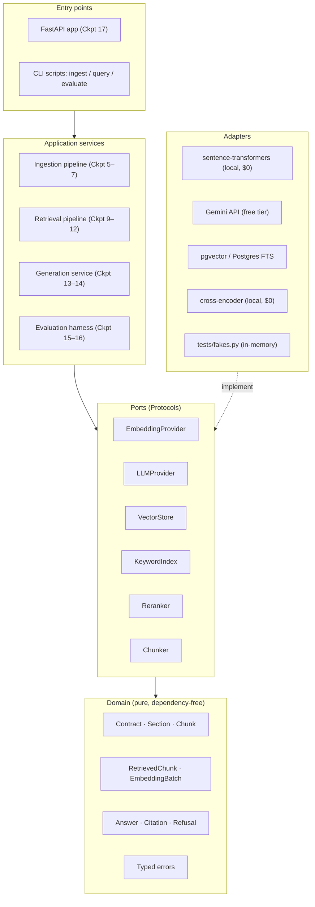

# Architecture

ClauseWise follows a clean/hexagonal architecture. Dependencies point inward:
adapters and entry points depend on ports; ports depend on the domain; the
domain depends on nothing.

## Rules

1. `domain/` imports nothing outside the standard library.
2. `ports/` imports only `domain/`.
3. Services import ports + domain, never adapters — adapters are injected at
   entry points (FastAPI dependencies, CLI wiring).
4. Provider SDK types and exceptions never cross a port boundary
   (`ProviderError` wraps them).
5. Scores carry `RetrievalSource` provenance; scores from different stages are
   never compared directly.

## Why it matters here

The ablation study (Checkpoint 16) — the project's flagship artifact — is only
cheap because chunkers, retrievers, and rerankers are injectable: each ablation
cell is a different wiring of the same services, not a code branch.
